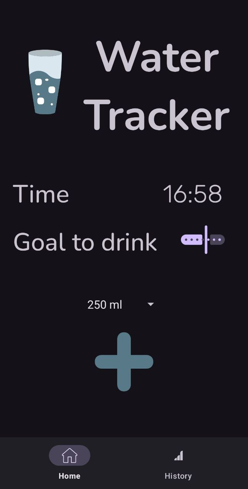
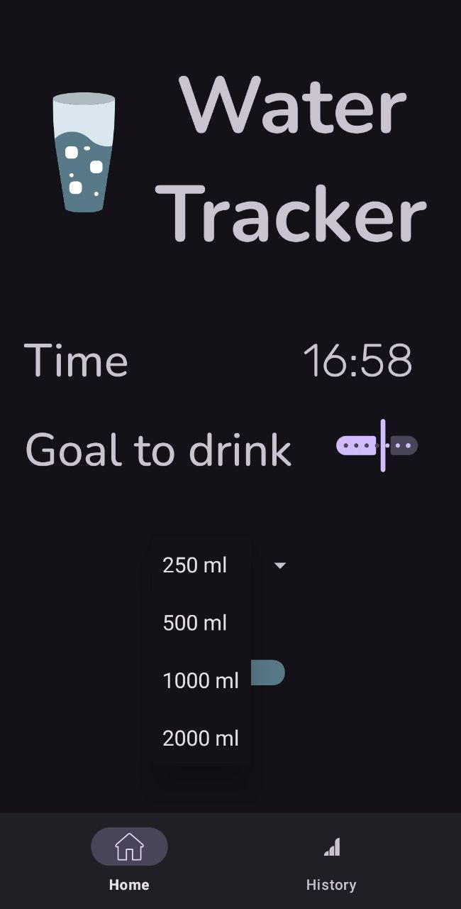
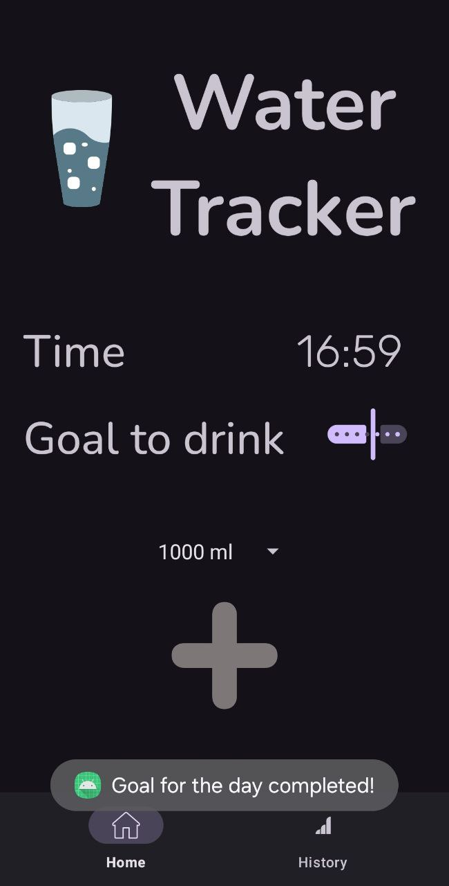
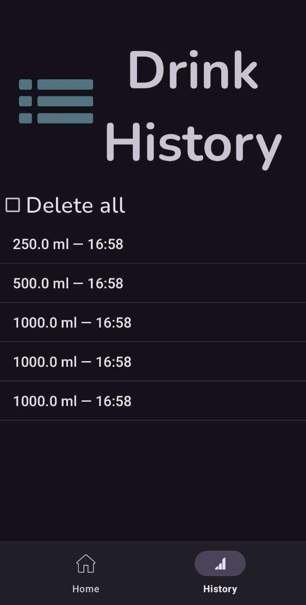
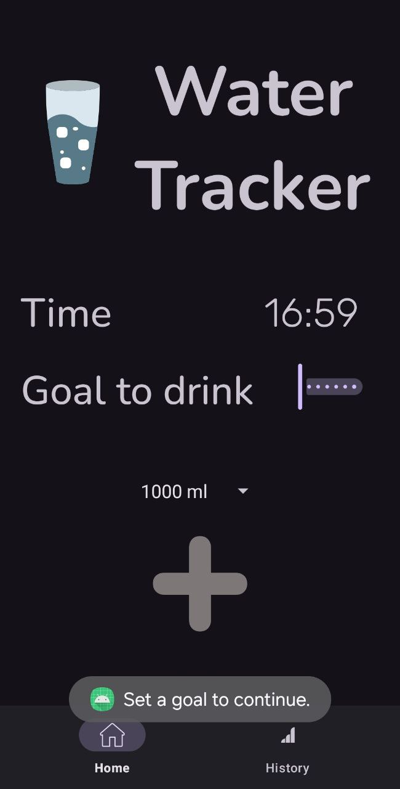

# 💧 WaterTracker App

Android-приложение для отслеживания потребления воды в течение дня. Установите свою цель, добавляйте выпитые объемы и достигайте ежедневной нормы!

---

## 📱 Основные функции
- 🎯 Установка ежедневной цели потребления воды (в литрах)
- 💦 Добавление выпитого количества воды с точным временем
- 📊 Автоматический подсчёт текущего объема
- 🔔 Уведомление о достижении цели
- 🕒 Отображение текущего времени
- 📆 Отдельный учёт на каждый день
- 💾 Сохранение данных между сессиями
- 🔄 Смена цвета иконки по достижении цели
---

## 🛠️ Технологии
- **Kotlin**
- **Android Jetpack (ViewModel, LiveData, Lifecycle)**
- **Room Database**
- **Coroutines + Flow**
- **ViewBinding**
- **SharedPreferences**
---

## 📷 Интерфейс

| Главный экран                   | Выбор объема                      | Цель достигнута             |
|:-------------------------------:|:---------------------------------:|:---------------------------:|
|  |  |  |

| История потребления            | Цель дня                          |
|:------------------------------:|:---------------------------------:|
|  |  |
---

## 🚀 Как запустить проект
1. Клонируй репозиторий:
   ```bash
   git clone https://github.com/yourusername/WaterTracker.git 
2. Открой проект в Android Studio
3. Собери и запусти на эмуляторе или физическом устройстве
---

### 🧑‍💻 Автор
Made with ❤️ by [leandoero](https://github.com/leandoero)
